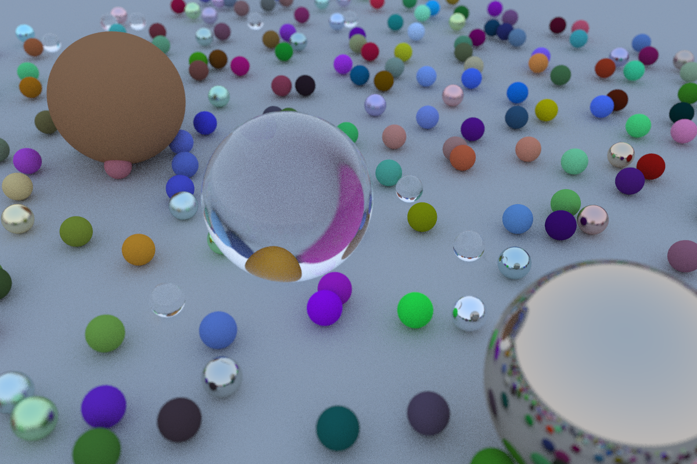

# Ray-Tracing-in-One-Weekend

## 项目简介

基于《Ray Tracing in One Weekend》系列书籍的光线追踪器实现，用于学习和理解计算机图形学中的光线追踪技术。

## 渲染结果

### Ray Tracing in One Weekend

实现了基础的光线追踪渲染器，包含以下核心技术：

- **光线-球体相交检测**：实现了光线与球体的数学求交算法
- **抗锯齿采样**：每像素多次随机采样实现抗锯齿效果
- **漫反射材质**：基于 Lambertian 反射模型的漫反射材质
- **金属材质**：带模糊反射的金属材质实现
- **电介质材质**：支持折射和反射的玻璃材质（使用 Schlick 近似）
- **可定位相机**：支持自定义视角、视野和景深效果




## 构建说明

### 依赖

- C++ 编译器（支持 C++17 或更高版本）
- CMake 3.10+

### 编译运行

```bash
mkdir build && cd build
cmake ..
ninja && ./RayTracing
```

输出图片将保存为 `image.ppm`

## 参考资料

- [Ray Tracing in One Weekend - 在线书籍](https://raytracing.github.io/books/RayTracingInOneWeekend.html)
- [Ray Tracing GitHub 仓库](https://github.com/RayTracing/raytracing.github.io)
- [Ray Tracing in One Weekend V3.0中文翻译](https://zhuanlan.zhihu.com/p/128582904)
- [Ray Tracing in One Weekend 超详解](https://www.cnblogs.com/lv-anchoret/p/10163205.html)

## 许可证

本项目遵循原项目的开源许可证。
